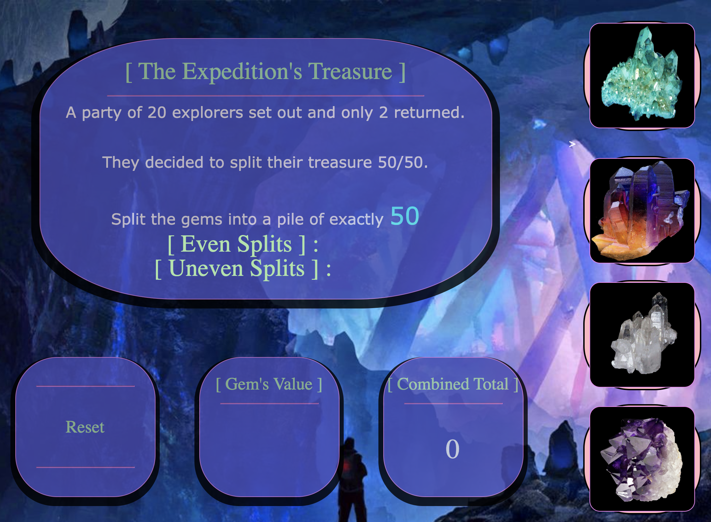

# Gem Loot Split

## Early Development Skills Practice

### Becoming skilled in the HTML, CSS, Javascript Trio

### Created an application in the form of a mini-game. Functions include a randomly generated score and the ability to track even matches vs. inaccurate matches. Each Crystal Tile will hold a value that is shown through hover events. The idea is to create as many even splits of the values. 

## This is an example of putting basic concepts of the languages together, and creating something to explore CSS properties. I constructed nested HTML sets and containers to style with layers and effects. Front-end Javascript functions were added included to bring them to life on the page and feel interactive. 

